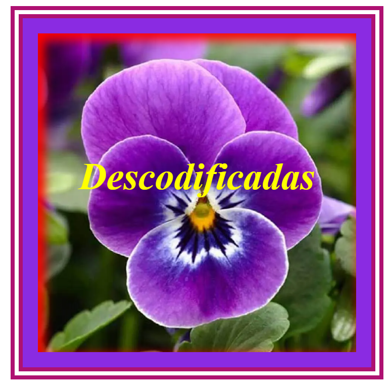

# Descodificadas_BoxModel

ATIVIDADE

Fazer um site que reproduza a imagem abaixo (ou flor semelhante) usando as configurações para Box Model.

As dimensões desta caixa são:

height: 400px;
 width: 400px

Modelo do que deveria ser criado: 

